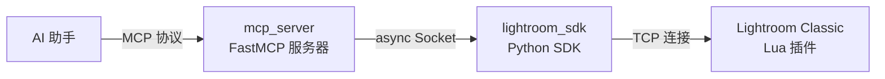
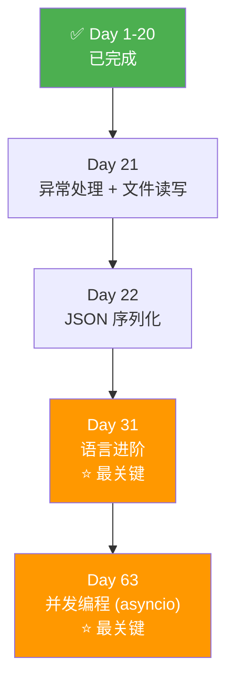

# 🗺️ MCP Lightroom 项目学习路线图

> 基于你已完成 Python-100-Days **Day 1-20** 的进度，以下是要读懂 `mcp_lightroom` 项目还需要掌握的课程内容。

---

## 项目概览

`mcp_lightroom` 是一个 **MCP (Model Context Protocol) 服务器**，通过 Python 异步 Socket 通信桥接 AI 助手与 Adobe Lightroom Classic。



| 包 | 模块数 | 职责 |
|---|---|---|
| `lightroom_sdk/` | 5 | Socket 通信、协议定义、异常体系、类型 |
| `mcp_server/` | 27 | 工具注册、服务模块、中间件、错误处理 |

---

## 🎯 需要学习的课程天数

### ⭐ 核心必学（直接影响代码理解）

#### 📘 Day 21 — 文件读写和异常处理
**项目中的应用：** 整个项目大量使用 `try/except/finally`，自定义异常层级，以及文件操作（读取端口文件）。

```python
# exceptions.py — 自定义异常继承体系
class LightroomSDKError(Exception):  # 基类
    ...
class ConnectionError(LightroomSDKError):  # 子类
    pass
class PhotoNotSelectedError(LightroomSDKError):  # 带默认参数
    def __init__(self, message="Please select a photo in Lightroom", ...):
        super().__init__(message, ...)
```

---

#### 📘 Day 22 — 对象的序列化和反序列化
**项目中的应用：** 所有命令通过 JSON 序列化/反序列化在 Socket 上传输。

```python
# socket_bridge.py
request_json = json.dumps(request, ensure_ascii=False) + '\n'  # 序列化
message = json.loads(line.decode('utf-8'))  # 反序列化
```

---

#### 📘 Day 31 — Python语言进阶
**项目中的应用：** 这是**最关键的一天**，涵盖项目中大量使用的高级特性：

| 知识点 | 项目应用 |
|---|---|
| 类型注解 (`typing`) | 每个文件都用：`Dict[str, Any]`, `Optional[str]`, `List[str]`, `Union[str, int]` |
| 抽象基类 (`ABC`) | [base.py](file:///D:/mcp_lightroom/lightroom_mcp/mcp_server/shared/base.py) 中 `LightroomServerModule(ABC)` |
| `@property` + `@abstractmethod` | `name` 和 `prefix` 属性 |
| 上下文管理器 | `async with self._reconnect_lock:` |
| 生成器表达式 | `next((p for p in files if p.exists()), None)` |

---

### ⭐ 重要补充（提升理解深度）

#### 📘 Day 63 — Python中的并发编程 (1-3)
**项目中的应用：** 整个项目构建在 `asyncio` 之上，这是**理解项目架构的核心**。

```python
# 项目中无处不在的 async/await
async def connect(self, retry_attempts=5):
    await self._bridge.connect(retry_attempts=retry_attempts)

# 异步上下文管理器
async def __aenter__(self):
    await self.connect()
    return self

# asyncio 核心概念
self._receive_task = asyncio.create_task(self._receive_loop())  # 创建任务
future = asyncio.get_running_loop().create_future()  # Future 对象
response = await asyncio.wait_for(future, timeout=timeout)  # 超时控制
self._reconnect_lock = asyncio.Lock()  # 异步锁
```

> [!IMPORTANT]
> `asyncio` 是这个项目最核心的技术。Day 63 的三篇内容建议全部仔细学习。

---

### 📌 有帮助但非必须

| Day | 主题 | 与项目关系 |
|---|---|---|
| **Day 27** | 操作 PDF 文件 | `_deps/pypdf` 被引用但非核心 |
| **Day 30** | 正则表达式 | 少量用于字符串处理 |

---

## 📋 推荐学习顺序



| 步骤 | 内容 | 预计时长 | 优先级 |
|---|---|---|---|
| 1️⃣ | Day 21 异常处理 | 1 天 | 🔴 必须 |
| 2️⃣ | Day 22 JSON 序列化 | 0.5 天 | 🔴 必须 |
| 3️⃣ | Day 31 语言进阶 | 2-3 天 | 🔴 必须 |
| 4️⃣ | Day 63 并发编程 (三篇) | 3-4 天 | 🔴 必须 |
| 5️⃣ | Day 27 PDF / Day 30 正则 | 1 天 | 🟡 可选 |

> [!TIP]
> 学完 Day 21 → 22 → 31 → 63 这**四站**后，你就能基本读懂整个 `mcp_lightroom` 项目的 Python 代码了。总共约 **7-9 天**的学习量。

---

## 🔍 课程中不直接覆盖但需了解的概念

这些概念在 Python-100-Days 课程中没有专门章节，但在项目中使用了，建议额外了解：

| 概念 | 项目中的使用 | 学习建议 |
|---|---|---|
| **Pydantic 数据模型** | `protocol.py`, `types/develop.py` 用 `BaseModel` 定义数据结构 | 阅读 [Pydantic 官方文档](https://docs.pydantic.dev/) 入门部分 |
| **MCP 协议** | 整个 `mcp_server/` 基于 FastMCP 框架 | 理解了 asyncio 后再看 FastMCP 文档 |
| **装饰器进阶用法** | `@main_server.tool`, `@property`, `@abstractmethod`, `@validator` | Day 31 会覆盖一部分，其余结合项目代码学 |

